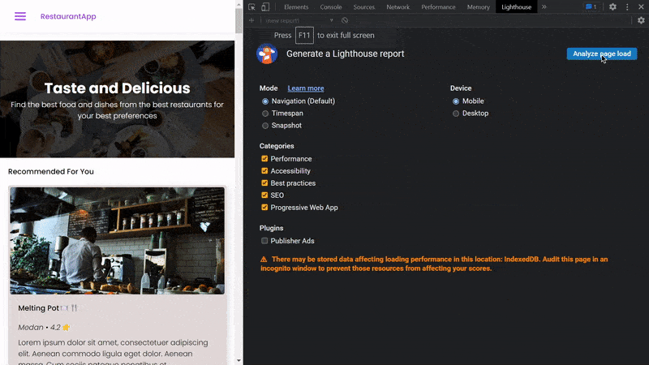

# Restaurant App Front-End Web

A project for completing Dicoding course's Front-end Web Expert.

## Milestones

- Progressive Web Apps (WPAs)
- Web Vitals
- Integration Test
- End-to-End Testing

## Previews

### Web

    

    

    

### Mobile

    

### Web Vitals Report

    

